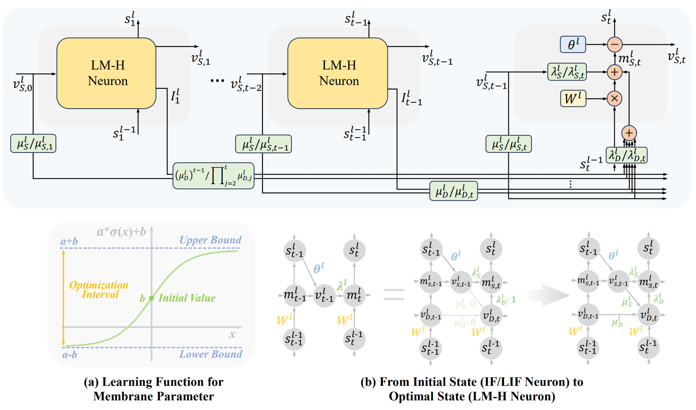
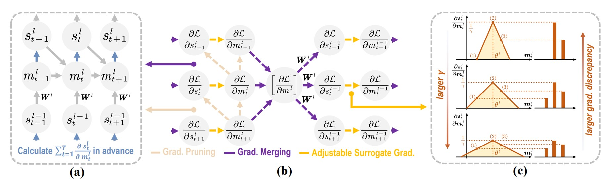
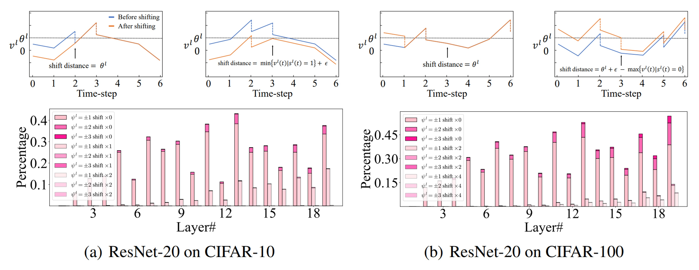
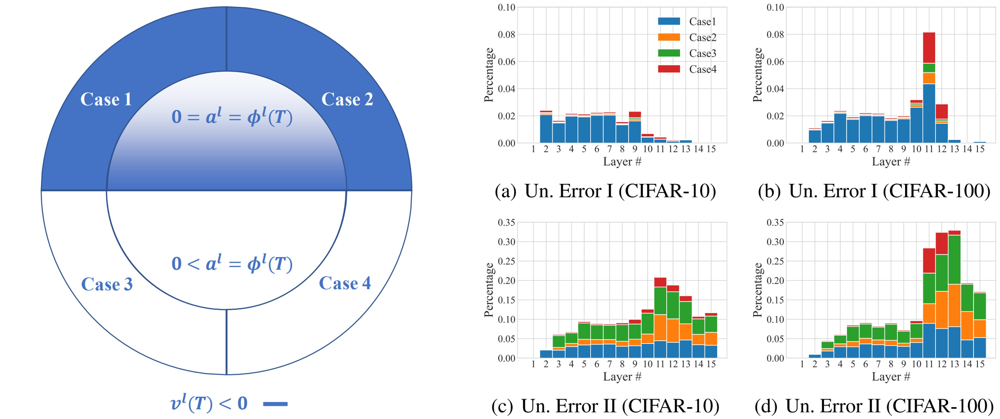
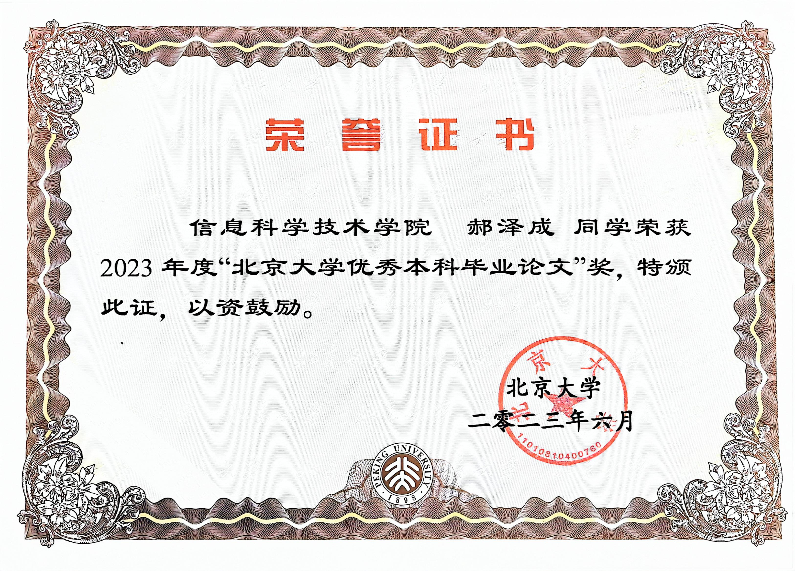

# 🧑‍🎨 About Me

I work at *National Engineering Research Center of Visual Technology, Peking University* as a PhD student now, majoring in visual information processing and brain like intelligence.  My research interest includes Spiking Neural Network (SNN), computer vision and computational neuroscience. Our related works have published at the top international ML, CV and AI conferences. If interested, feel free to email me at [haozecheng@pku.edu.cn](haozecheng@pku.edu.cn).

# 🔥 News

- *2024.02*: &nbsp;🎉 3 papers have been accepted by ICLR 2024, including 2 first-authored papers. I will participate in the review of ICML 2024.

# 📝 Publications

ICLR 2024

**A Progressive Training Framework for Spiking Neural Networks with Learnable Multi-hierarchical Model**

📰[**Paper**]([https://openreview.net/forum?id=g52tgL8jy6) $\textbf{|}$ **ICLR 2024**

**Zecheng Hao**, Xinyu Shi, Zihan Huang, Tong Bu, Zhaofei Yu, Tiejun Huang

ICLR 2024

**Threaten Spiking Neural Networks through Combining Rate and Temporal Information**

📰[**Paper**](https://openreview.net/forum?id=xv8iGxENyI) $\textbf{|}$ **ICLR 2024**

**Zecheng Hao**, Tong Bu, Xinyu Shi, Zihan Huang, Tiejun Huang, Zhaofei Yu

ICLR 2023

**Bridging the Gap between ANNs and SNNs by Calibrating Offset Spikes**

🖥️[**Code**](https://github.com/hzc1208/ANN2SNN_COS)  $\textbf{|}$ 📰[**Paper**](https://openreview.net/forum?id=PFbzoWZyZRX) $\textbf{|}$ **ICLR 2023**

**Zecheng Hao**, Jianhao Ding, Tong Bu, Tiejun Huang, Zhaofei Yu

AAAI 2023

**Reducing ANN-SNN Conversion Error through Residual Membrane Potential**

🖥️[**Code**](https://github.com/hzc1208/ANN2SNN_SRP)  $\textbf{|}$ 📰[**Paper**](https://arxiv.org/abs/2302.02091) $\textbf{|}$ **AAAI 2023, Oral**

**Zecheng Hao**, Tong Bu, Jianhao Ding, Tiejun Huang, Zhaofei Yu

`ICLR 2024, Spotlight` **Towards Energy Efficient Spiking Neural Networks: An Unstructured Pruning Framework**

📰[**Paper**](https://openreview.net/forum?id=eoSeaK4QJo) 

Xinyu Shi, Jianhao Ding, **Zecheng Hao**, Zhaofei Yu

`CVPR 2023	` **Rate Gradient Approximation Attack Threats Deep Spiking Neural Networks**

🖥️[**Code**](https://github. com/putshua/SNN_attack_RGA) $\textbf{|}$ 📰[**Paper**](http://openaccess.thecvf.com/content/CVPR2023/html/Bu_Rate_Gradient_Approximation_Attack_Threats_Deep_Spiking_Neural_Networks_CVPR_2023_paper.html)

Tong Bu, Jianhao Ding, **Zecheng Hao**, Zhaofei Yu

# 🎖 Honors and Awards

PKU 2023

*2023.06* Excellent Undergraduate Thesis of Peking University

# 📖 Educations

- *2023.09 - 2028.06*, PhD student, Peking University, Beijing. 
- *2019.09 - 2023.06*, Undergraduate, Peking University, Beijing. 

# 💻 Academic Services

- **Reviewer** of Conferences: NeurIPS, ICLR, ICML